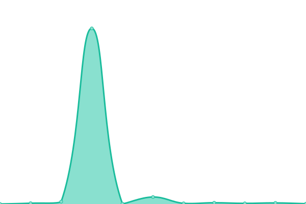
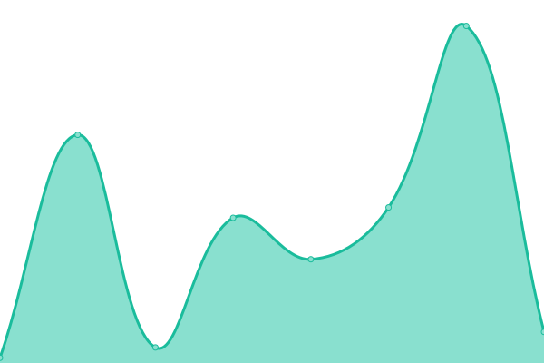
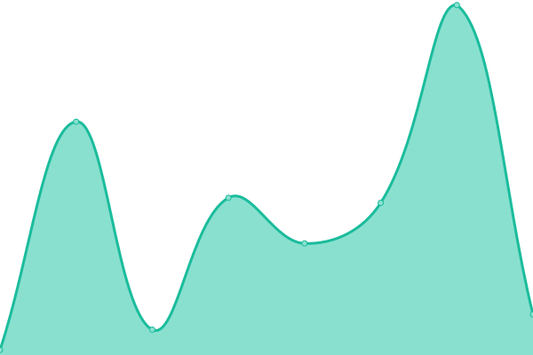
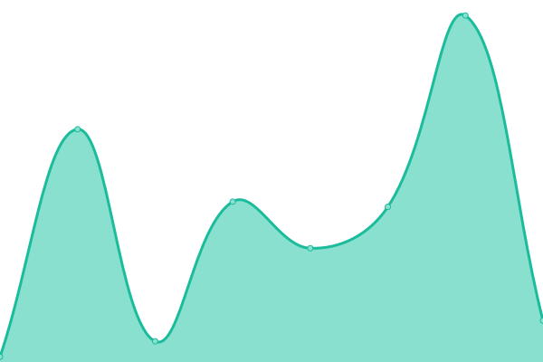
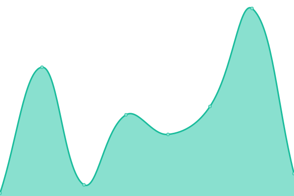
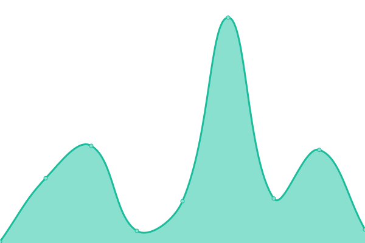

# [📈 Live Status](https://SimronJ.github.io/Houser-Uptime): <!--live status--> **🟧 Partial outage**

This repository contains the open-source uptime monitor and status page for [Simranjeet Singh](https://SimronJ.github.io/Houser-Uptime), powered by [Upptime](https://github.com/upptime/upptime).

With [Upptime](https://upptime.js.org), you can get your own unlimited and free uptime monitor and status page, powered entirely by a GitHub repository. We use [Issues](https://github.com/SimronJ/Houser-Uptime/issues) as incident reports, [Actions](https://github.com/SimronJ/Houser-Uptime/actions) as uptime monitors, and [Pages](https://SimronJ.github.io/Houser-Uptime) for the status page.

<!--start: status pages-->
<!-- This summary is generated by Upptime (https://github.com/upptime/upptime) -->
<!-- Do not edit this manually, your changes will be overwritten -->
<!-- prettier-ignore -->
| URL | Status | History | Response Time | Uptime |
| --- | ------ | ------- | ------------- | ------ |
|  [Prod - GET /user-roles](https://api.thehouserapp.com/user-roles) | 🟥 Down | [prod-get-user-roles.yml](https://github.com/SimronJ/Houser-Uptime/commits/HEAD/history/prod-get-user-roles.yml) | 

 2059ms
     
 | 

<a href="https://SimronJ.github.io/Houser-Uptime/history/prod-get-user-roles">95.41%</a>
    

|  [Staging - GET /user-roles](http://54.162.155.98:3001/user-roles) | 🟩 Up | [staging-get-user-roles.yml](https://github.com/SimronJ/Houser-Uptime/commits/HEAD/history/staging-get-user-roles.yml) | 

 312ms
     
 | 

<a href="https://SimronJ.github.io/Houser-Uptime/history/staging-get-user-roles">100.00%</a>
    

|  [Prod - GET /user-subscription](https://api.thehouserapp.com/user-subscription) | 🟩 Up | [prod-get-user-subscription.yml](https://github.com/SimronJ/Houser-Uptime/commits/HEAD/history/prod-get-user-subscription.yml) | 

 10ms
     
 | 

<a href="https://SimronJ.github.io/Houser-Uptime/history/prod-get-user-subscription">100.00%</a>
    

|  [Staging - GET /user-subscription](http://54.162.155.98:3001/user-subscription) | 🟩 Up | [staging-get-user-subscription.yml](https://github.com/SimronJ/Houser-Uptime/commits/HEAD/history/staging-get-user-subscription.yml) | 

 8ms
     
 | 

<a href="https://SimronJ.github.io/Houser-Uptime/history/staging-get-user-subscription">100.00%</a>
    

|  [Prod - GET /user-subscription-history](https://api.thehouserapp.com/user-subscription-history) | 🟩 Up | [prod-get-user-subscription-history.yml](https://github.com/SimronJ/Houser-Uptime/commits/HEAD/history/prod-get-user-subscription-history.yml) | 

 14ms
     
 | 

<a href="https://SimronJ.github.io/Houser-Uptime/history/prod-get-user-subscription-history">100.00%</a>
    

|  [Staging - GET /user-subscription-history](http://54.162.155.98:3001/user-subscription-history) | 🟩 Up | [staging-get-user-subscription-history.yml](https://github.com/SimronJ/Houser-Uptime/commits/HEAD/history/staging-get-user-subscription-history.yml) | 

 8ms
     
 | 

<a href="https://SimronJ.github.io/Houser-Uptime/history/staging-get-user-subscription-history">100.00%</a>
    

|  [Prod - GET /user-profile](https://api.thehouserapp.com/user-profile) | 🟩 Up | [prod-get-user-profile.yml](https://github.com/SimronJ/Houser-Uptime/commits/HEAD/history/prod-get-user-profile.yml) | 

 10ms
     
 | 

<a href="https://SimronJ.github.io/Houser-Uptime/history/prod-get-user-profile">100.00%</a>
    

|  [Staging - GET /user-profile](http://54.162.155.98:3001/user-profile) | 🟩 Up | [staging-get-user-profile.yml](https://github.com/SimronJ/Houser-Uptime/commits/HEAD/history/staging-get-user-profile.yml) | 

 8ms
     
 | 

<a href="https://SimronJ.github.io/Houser-Uptime/history/staging-get-user-profile">100.00%</a>
    

|  [Prod - GET /clients](https://api.thehouserapp.com/clients?page=1&limit=1) | 🟥 Down | [prod-get-clients.yml](https://github.com/SimronJ/Houser-Uptime/commits/HEAD/history/prod-get-clients.yml) | 

 125ms
     
 | 

<a href="https://SimronJ.github.io/Houser-Uptime/history/prod-get-clients">95.46%</a>
    

|  [Staging - GET /clients](http://54.162.155.98:3001/clients?page=1&limit=1) | 🟩 Up | [staging-get-clients.yml](https://github.com/SimronJ/Houser-Uptime/commits/HEAD/history/staging-get-clients.yml) | 

 65ms
     
 | 

<a href="https://SimronJ.github.io/Houser-Uptime/history/staging-get-clients">100.00%</a>
    

|  [Prod - GET /user/1](https://api.thehouserapp.com/user/1) | 🟩 Up | [prod-get-user-1.yml](https://github.com/SimronJ/Houser-Uptime/commits/HEAD/history/prod-get-user-1.yml) | 

 72ms
     
 | 

<a href="https://SimronJ.github.io/Houser-Uptime/history/prod-get-user-1">96.15%</a>
    

|  [Staging - GET /user/1](http://54.162.155.98:3001/user/1) | 🟩 Up | [staging-get-user-1.yml](https://github.com/SimronJ/Houser-Uptime/commits/HEAD/history/staging-get-user-1.yml) | 

 13ms
     
 | 

<a href="https://SimronJ.github.io/Houser-Uptime/history/staging-get-user-1">100.00%</a>
    

|  [Prod - GET /getAllProperties](https://api.thehouserapp.com/getAllProperties?minLatitude=33.0000&minLongitude=-97.0000&maxLatitude=33.0100&maxLongitude=-96.9900&pageSize=1) | 🟩 Up | [prod-get-get-all-properties.yml](https://github.com/SimronJ/Houser-Uptime/commits/HEAD/history/prod-get-get-all-properties.yml) | 

 57ms
     
 | 

<a href="https://SimronJ.github.io/Houser-Uptime/history/prod-get-get-all-properties">96.20%</a>
    

|  [Staging - GET /getAllProperties](http://54.162.155.98:3001/getAllProperties?minLatitude=33.0000&minLongitude=-97.0000&maxLatitude=33.0100&maxLongitude=-96.9900&pageSize=1) | 🟩 Up | [staging-get-get-all-properties.yml](https://github.com/SimronJ/Houser-Uptime/commits/HEAD/history/staging-get-get-all-properties.yml) | 

 14ms
     
 | 

<a href="https://SimronJ.github.io/Houser-Uptime/history/staging-get-get-all-properties">100.00%</a>
    

|  [Prod - GET /PlanpoProperties](https://api.thehouserapp.com/PlanpoProperties) | 🟥 Down | [prod-get-planpo-properties.yml](https://github.com/SimronJ/Houser-Uptime/commits/HEAD/history/prod-get-planpo-properties.yml) | 

 12702ms
     
 | 

<a href="https://SimronJ.github.io/Houser-Uptime/history/prod-get-planpo-properties">93.58%</a>
    

|  [Staging - GET /PlanpoProperties](http://54.162.155.98:3001/PlanpoProperties) | 🟩 Up | [staging-get-planpo-properties.yml](https://github.com/SimronJ/Houser-Uptime/commits/HEAD/history/staging-get-planpo-properties.yml) | 

 6029ms
     
 | 

<a href="https://SimronJ.github.io/Houser-Uptime/history/staging-get-planpo-properties">99.71%</a>
    

|  [Prod - GET /getAllPropertiesCoordinates](https://api.thehouserapp.com/getAllPropertiesCoordinates) | 🟩 Up | [prod-get-get-all-properties-coordinates.yml](https://github.com/SimronJ/Houser-Uptime/commits/HEAD/history/prod-get-get-all-properties-coordinates.yml) | 

 15ms
     
 | 

<a href="https://SimronJ.github.io/Houser-Uptime/history/prod-get-get-all-properties-coordinates">100.00%</a>
    

|  [Staging - GET /getAllPropertiesCoordinates](http://54.162.155.98:3001/getAllPropertiesCoordinates) | 🟩 Up | [staging-get-get-all-properties-coordinates.yml](https://github.com/SimronJ/Houser-Uptime/commits/HEAD/history/staging-get-get-all-properties-coordinates.yml) | 

 8ms
     
 | 

<a href="https://SimronJ.github.io/Houser-Uptime/history/staging-get-get-all-properties-coordinates">100.00%</a>
    

|  [Prod - GET /properties/by-polygon](https://api.thehouserapp.com/properties/by-polygon) | 🟩 Up | [prod-get-properties-by-polygon.yml](https://github.com/SimronJ/Houser-Uptime/commits/HEAD/history/prod-get-properties-by-polygon.yml) | 

 10ms
     
 | 

<a href="https://SimronJ.github.io/Houser-Uptime/history/prod-get-properties-by-polygon">100.00%</a>
    

|  [Staging - GET /properties/by-polygon](http://54.162.155.98:3001/properties/by-polygon) | 🟩 Up | [staging-get-properties-by-polygon.yml](https://github.com/SimronJ/Houser-Uptime/commits/HEAD/history/staging-get-properties-by-polygon.yml) | 

 8ms
     
 | 

<a href="https://SimronJ.github.io/Houser-Uptime/history/staging-get-properties-by-polygon">100.00%</a>
    

|  [Prod - GET /propertyById/1](https://api.thehouserapp.com/propertyById/1) | 🟩 Up | [prod-get-property-by-id-1.yml](https://github.com/SimronJ/Houser-Uptime/commits/HEAD/history/prod-get-property-by-id-1.yml) | 

 10ms
     
 | 

<a href="https://SimronJ.github.io/Houser-Uptime/history/prod-get-property-by-id-1">100.00%</a>
    

|  [Staging - GET /propertyById/1](http://54.162.155.98:3001/propertyById/1) | 🟩 Up | [staging-get-property-by-id-1.yml](https://github.com/SimronJ/Houser-Uptime/commits/HEAD/history/staging-get-property-by-id-1.yml) | 

 7ms
     
 | 

<a href="https://SimronJ.github.io/Houser-Uptime/history/staging-get-property-by-id-1">100.00%</a>
    

|  [Prod - GET /property/1](https://api.thehouserapp.com/property/1) | 🟩 Up | [prod-get-property-1.yml](https://github.com/SimronJ/Houser-Uptime/commits/HEAD/history/prod-get-property-1.yml) | 

 10ms
     
 | 

<a href="https://SimronJ.github.io/Houser-Uptime/history/prod-get-property-1">100.00%</a>
    

|  [Staging - GET /property/1](http://54.162.155.98:3001/property/1) | 🟩 Up | [staging-get-property-1.yml](https://github.com/SimronJ/Houser-Uptime/commits/HEAD/history/staging-get-property-1.yml) | 

 8ms
     
 | 

<a href="https://SimronJ.github.io/Houser-Uptime/history/staging-get-property-1">100.00%</a>
    

|  [Prod - GET /getPropertiesByAddress](https://api.thehouserapp.com/getPropertiesByAddress?address=123%20Main%20St) | 🟥 Down | [prod-get-get-properties-by-address.yml](https://github.com/SimronJ/Houser-Uptime/commits/HEAD/history/prod-get-get-properties-by-address.yml) | 

 118ms
     
 | 

<a href="https://SimronJ.github.io/Houser-Uptime/history/prod-get-get-properties-by-address">84.26%</a>
    

|  [Staging - GET /getPropertiesByAddress](http://54.162.155.98:3001/getPropertiesByAddress?address=123%20Main%20St) | 🟩 Up | [staging-get-get-properties-by-address.yml](https://github.com/SimronJ/Houser-Uptime/commits/HEAD/history/staging-get-get-properties-by-address.yml) | 

 122ms
     
 | 

<a href="https://SimronJ.github.io/Houser-Uptime/history/staging-get-get-properties-by-address">100.00%</a>
    

|  [Prod - GET /properties/filterByCityAndZip](https://api.thehouserapp.com/properties/filterByCityAndZip?city=Plano) | 🟥 Down | [prod-get-properties-filter-by-city-and-zip.yml](https://github.com/SimronJ/Houser-Uptime/commits/HEAD/history/prod-get-properties-filter-by-city-and-zip.yml) | 

 2772ms
     
 | 

<a href="https://SimronJ.github.io/Houser-Uptime/history/prod-get-properties-filter-by-city-and-zip">93.29%</a>
    

|  [Staging - GET /properties/filterByCityAndZip](http://54.162.155.98:3001/properties/filterByCityAndZip?city=Plano) | 🟩 Up | [staging-get-properties-filter-by-city-and-zip.yml](https://github.com/SimronJ/Houser-Uptime/commits/HEAD/history/staging-get-properties-filter-by-city-and-zip.yml) | 

 2415ms
     
 | 

<a href="https://SimronJ.github.io/Houser-Uptime/history/staging-get-properties-filter-by-city-and-zip">100.00%</a>
    

|  [Prod - GET /properties/basicFilters](https://api.thehouserapp.com/properties/basicFilters) | 🟥 Down | [prod-get-properties-basic-filters.yml](https://github.com/SimronJ/Houser-Uptime/commits/HEAD/history/prod-get-properties-basic-filters.yml) | 

 3437ms
     
 | 

<a href="https://SimronJ.github.io/Houser-Uptime/history/prod-get-properties-basic-filters">93.01%</a>
    

|  [Staging - GET /properties/basicFilters](http://54.162.155.98:3001/properties/basicFilters) | 🟩 Up | [staging-get-properties-basic-filters.yml](https://github.com/SimronJ/Houser-Uptime/commits/HEAD/history/staging-get-properties-basic-filters.yml) | 

 137ms
     
 | 

<a href="https://SimronJ.github.io/Houser-Uptime/history/staging-get-properties-basic-filters">91.64%</a>
    

|  [Prod - GET /properties/cashflow/1](https://api.thehouserapp.com/properties/cashflow/1) | 🟥 Down | [prod-get-properties-cashflow-1.yml](https://github.com/SimronJ/Houser-Uptime/commits/HEAD/history/prod-get-properties-cashflow-1.yml) | 

 3386ms
     
 | 

<a href="https://SimronJ.github.io/Houser-Uptime/history/prod-get-properties-cashflow-1">93.73%</a>
    

|  [Staging - GET /properties/cashflow/1](http://54.162.155.98:3001/properties/cashflow/1) | 🟩 Up | [staging-get-properties-cashflow-1.yml](https://github.com/SimronJ/Houser-Uptime/commits/HEAD/history/staging-get-properties-cashflow-1.yml) | 

 32ms
     
 | 

<a href="https://SimronJ.github.io/Houser-Uptime/history/staging-get-properties-cashflow-1">100.00%</a>
    

|  [Prod - GET /properties/firstTimeHomeBuyer/1](https://api.thehouserapp.com/properties/firstTimeHomeBuyer/1) | 🟥 Down | [prod-get-properties-first-time-home-buyer-1.yml](https://github.com/SimronJ/Houser-Uptime/commits/HEAD/history/prod-get-properties-first-time-home-buyer-1.yml) | 

 1633ms
     
 | 

<a href="https://SimronJ.github.io/Houser-Uptime/history/prod-get-properties-first-time-home-buyer-1">94.15%</a>
    

|  [Staging - GET /properties/firstTimeHomeBuyer/1](http://54.162.155.98:3001/properties/firstTimeHomeBuyer/1) | 🟩 Up | [staging-get-properties-first-time-home-buyer-1.yml](https://github.com/SimronJ/Houser-Uptime/commits/HEAD/history/staging-get-properties-first-time-home-buyer-1.yml) | 

 34ms
     
 | 

<a href="https://SimronJ.github.io/Houser-Uptime/history/staging-get-properties-first-time-home-buyer-1">99.69%</a>
    

|  [Prod - GET /properties/fixAndFlip/1](https://api.thehouserapp.com/properties/fixAndFlip/1) | 🟥 Down | [prod-get-properties-fix-and-flip-1.yml](https://github.com/SimronJ/Houser-Uptime/commits/HEAD/history/prod-get-properties-fix-and-flip-1.yml) | 

 180ms
     
 | 

<a href="https://SimronJ.github.io/Houser-Uptime/history/prod-get-properties-fix-and-flip-1">93.94%</a>
    

|  [Staging - GET /properties/fixAndFlip/1](http://54.162.155.98:3001/properties/fixAndFlip/1) | 🟩 Up | [staging-get-properties-fix-and-flip-1.yml](https://github.com/SimronJ/Houser-Uptime/commits/HEAD/history/staging-get-properties-fix-and-flip-1.yml) | 

 18ms
     
 | 

<a href="https://SimronJ.github.io/Houser-Uptime/history/staging-get-properties-fix-and-flip-1">99.69%</a>
    

|  [Prod - GET /properties/house-hack/1](https://api.thehouserapp.com/properties/house-hack/1) | 🟥 Down | [prod-get-properties-house-hack-1.yml](https://github.com/SimronJ/Houser-Uptime/commits/HEAD/history/prod-get-properties-house-hack-1.yml) | 

 103ms
     
 | 

<a href="https://SimronJ.github.io/Houser-Uptime/history/prod-get-properties-house-hack-1">94.84%</a>
    

|  [Staging - GET /properties/house-hack/1](http://54.162.155.98:3001/properties/house-hack/1) | 🟩 Up | [staging-get-properties-house-hack-1.yml](https://github.com/SimronJ/Houser-Uptime/commits/HEAD/history/staging-get-properties-house-hack-1.yml) | 

 10ms
     
 | 

<a href="https://SimronJ.github.io/Houser-Uptime/history/staging-get-properties-house-hack-1">100.00%</a>
    

|  [Prod - GET /property-questionnaires](https://api.thehouserapp.com/property-questionnaires) | 🟩 Up | [prod-get-property-questionnaires.yml](https://github.com/SimronJ/Houser-Uptime/commits/HEAD/history/prod-get-property-questionnaires.yml) | 

 10ms
     
 | 

<a href="https://SimronJ.github.io/Houser-Uptime/history/prod-get-property-questionnaires">100.00%</a>
    

|  [Staging - GET /property-questionnaires](http://54.162.155.98:3001/property-questionnaires) | 🟩 Up | [staging-get-property-questionnaires.yml](https://github.com/SimronJ/Houser-Uptime/commits/HEAD/history/staging-get-property-questionnaires.yml) | 

 7ms
     
 | 

<a href="https://SimronJ.github.io/Houser-Uptime/history/staging-get-property-questionnaires">100.00%</a>
    

|  [Prod - GET /property-questionnaires/1](https://api.thehouserapp.com/property-questionnaires/1) | 🟩 Up | [prod-get-property-questionnaires-1.yml](https://github.com/SimronJ/Houser-Uptime/commits/HEAD/history/prod-get-property-questionnaires-1.yml) | 

 10ms
     
 | 

<a href="https://SimronJ.github.io/Houser-Uptime/history/prod-get-property-questionnaires-1">100.00%</a>
    

|  [Staging - GET /property-questionnaires/1](http://54.162.155.98:3001/property-questionnaires/1) | 🟩 Up | [staging-get-property-questionnaires-1.yml](https://github.com/SimronJ/Houser-Uptime/commits/HEAD/history/staging-get-property-questionnaires-1.yml) | 

 7ms
     
 | 

<a href="https://SimronJ.github.io/Houser-Uptime/history/staging-get-property-questionnaires-1">100.00%</a>
    

|  [Prod - GET /property-questionnaires/prefilled/1](https://api.thehouserapp.com/property-questionnaires/prefilled/1) | 🟩 Up | [prod-get-property-questionnaires-prefilled-1.yml](https://github.com/SimronJ/Houser-Uptime/commits/HEAD/history/prod-get-property-questionnaires-prefilled-1.yml) | 

 10ms
     
 | 

<a href="https://SimronJ.github.io/Houser-Uptime/history/prod-get-property-questionnaires-prefilled-1">100.00%</a>
    

|  [Staging - GET /property-questionnaires/prefilled/1](http://54.162.155.98:3001/property-questionnaires/prefilled/1) | 🟩 Up | [staging-get-property-questionnaires-prefilled-1.yml](https://github.com/SimronJ/Houser-Uptime/commits/HEAD/history/staging-get-property-questionnaires-prefilled-1.yml) | 

 7ms
     
 | 

<a href="https://SimronJ.github.io/Houser-Uptime/history/staging-get-property-questionnaires-prefilled-1">100.00%</a>
    

|  [Prod - GET /questionnaire](https://api.thehouserapp.com/questionnaire) | 🟩 Up | [prod-get-questionnaire.yml](https://github.com/SimronJ/Houser-Uptime/commits/HEAD/history/prod-get-questionnaire.yml) | 

 16ms
     
 | 

<a href="https://SimronJ.github.io/Houser-Uptime/history/prod-get-questionnaire">100.00%</a>
    

|  [Staging - GET /questionnaire](http://54.162.155.98:3001/questionnaire) | 🟩 Up | [staging-get-questionnaire.yml](https://github.com/SimronJ/Houser-Uptime/commits/HEAD/history/staging-get-questionnaire.yml) | 

 7ms
     
 | 

<a href="https://SimronJ.github.io/Houser-Uptime/history/staging-get-questionnaire">100.00%</a>
    

|  [Prod - GET /questions](https://api.thehouserapp.com/questions) | 🟩 Up | [prod-get-questions.yml](https://github.com/SimronJ/Houser-Uptime/commits/HEAD/history/prod-get-questions.yml) | 

 10ms
     
 | 

<a href="https://SimronJ.github.io/Houser-Uptime/history/prod-get-questions">100.00%</a>
    

|  [Staging - GET /questions](http://54.162.155.98:3001/questions) | 🟩 Up | [staging-get-questions.yml](https://github.com/SimronJ/Houser-Uptime/commits/HEAD/history/staging-get-questions.yml) | 

 7ms
     
 | 

<a href="https://SimronJ.github.io/Houser-Uptime/history/staging-get-questions">100.00%</a>
    

|  [Prod - GET /user-likes](https://api.thehouserapp.com/user-likes) | 🟩 Up | [prod-get-user-likes.yml](https://github.com/SimronJ/Houser-Uptime/commits/HEAD/history/prod-get-user-likes.yml) | 

 10ms
     
 | 

<a href="https://SimronJ.github.io/Houser-Uptime/history/prod-get-user-likes">100.00%</a>
    

|  [Staging - GET /user-likes](http://54.162.155.98:3001/user-likes) | 🟩 Up | [staging-get-user-likes.yml](https://github.com/SimronJ/Houser-Uptime/commits/HEAD/history/staging-get-user-likes.yml) | 

 7ms
     
 | 

<a href="https://SimronJ.github.io/Houser-Uptime/history/staging-get-user-likes">100.00%</a>
    

|  [Prod - GET /buy-house](https://api.thehouserapp.com/buy-house) | 🟩 Up | [prod-get-buy-house.yml](https://github.com/SimronJ/Houser-Uptime/commits/HEAD/history/prod-get-buy-house.yml) | 

 10ms
     
 | 

<a href="https://SimronJ.github.io/Houser-Uptime/history/prod-get-buy-house">100.00%</a>
    

|  [Staging - GET /buy-house](http://54.162.155.98:3001/buy-house) | 🟩 Up | [staging-get-buy-house.yml](https://github.com/SimronJ/Houser-Uptime/commits/HEAD/history/staging-get-buy-house.yml) | 

 7ms
     
 | 

<a href="https://SimronJ.github.io/Houser-Uptime/history/staging-get-buy-house">100.00%</a>
    

|  [Prod - GET /buy-property](https://api.thehouserapp.com/buy-property) | 🟩 Up | [prod-get-buy-property.yml](https://github.com/SimronJ/Houser-Uptime/commits/HEAD/history/prod-get-buy-property.yml) | 

 10ms
     
 | 

<a href="https://SimronJ.github.io/Houser-Uptime/history/prod-get-buy-property">100.00%</a>
    

|  [Staging - GET /buy-property](http://54.162.155.98:3001/buy-property) | 🟩 Up | [staging-get-buy-property.yml](https://github.com/SimronJ/Houser-Uptime/commits/HEAD/history/staging-get-buy-property.yml) | 

 7ms
     
 | 

<a href="https://SimronJ.github.io/Houser-Uptime/history/staging-get-buy-property">100.00%</a>
    

|  [Prod - GET /buy-property/1](https://api.thehouserapp.com/buy-property/1) | 🟩 Up | [prod-get-buy-property-1.yml](https://github.com/SimronJ/Houser-Uptime/commits/HEAD/history/prod-get-buy-property-1.yml) | 

 10ms
     
 | 

<a href="https://SimronJ.github.io/Houser-Uptime/history/prod-get-buy-property-1">100.00%</a>
    

|  [Staging - GET /buy-property/1](http://54.162.155.98:3001/buy-property/1) | 🟩 Up | [staging-get-buy-property-1.yml](https://github.com/SimronJ/Houser-Uptime/commits/HEAD/history/staging-get-buy-property-1.yml) | 

 7ms
     
 | 

<a href="https://SimronJ.github.io/Houser-Uptime/history/staging-get-buy-property-1">100.00%</a>
    

|  [Prod - GET /showings](https://api.thehouserapp.com/showings) | 🟩 Up | [prod-get-showings.yml](https://github.com/SimronJ/Houser-Uptime/commits/HEAD/history/prod-get-showings.yml) | 

 10ms
     
 | 

<a href="https://SimronJ.github.io/Houser-Uptime/history/prod-get-showings">100.00%</a>
    

|  [Staging - GET /showings](http://54.162.155.98:3001/showings) | 🟩 Up | [staging-get-showings.yml](https://github.com/SimronJ/Houser-Uptime/commits/HEAD/history/staging-get-showings.yml) | 

 7ms
     
 | 

<a href="https://SimronJ.github.io/Houser-Uptime/history/staging-get-showings">100.00%</a>
    

|  [Prod - GET /showings/1](https://api.thehouserapp.com/showings/1) | 🟩 Up | [prod-get-showings-1.yml](https://github.com/SimronJ/Houser-Uptime/commits/HEAD/history/prod-get-showings-1.yml) | 

 10ms
     
 | 

<a href="https://SimronJ.github.io/Houser-Uptime/history/prod-get-showings-1">100.00%</a>
    

|  [Staging - GET /showings/1](http://54.162.155.98:3001/showings/1) | 🟩 Up | [staging-get-showings-1.yml](https://github.com/SimronJ/Houser-Uptime/commits/HEAD/history/staging-get-showings-1.yml) | 

 7ms
     
 | 

<a href="https://SimronJ.github.io/Houser-Uptime/history/staging-get-showings-1">100.00%</a>
    

|  [Prod - GET /signedaudio](https://api.thehouserapp.com/signedaudio) | 🟩 Up | [prod-get-signedaudio.yml](https://github.com/SimronJ/Houser-Uptime/commits/HEAD/history/prod-get-signedaudio.yml) | 

 16ms
     
 | 

<a href="https://SimronJ.github.io/Houser-Uptime/history/prod-get-signedaudio">100.00%</a>
    

|  [Staging - GET /signedaudio](http://54.162.155.98:3001/signedaudio) | 🟩 Up | [staging-get-signedaudio.yml](https://github.com/SimronJ/Houser-Uptime/commits/HEAD/history/staging-get-signedaudio.yml) | 

 12ms
     
 | 

<a href="https://SimronJ.github.io/Houser-Uptime/history/staging-get-signedaudio">100.00%</a>
    

|  [Prod - GET /subscription-plans](https://api.thehouserapp.com/subscription-plans) | 🟩 Up | [prod-get-subscription-plans.yml](https://github.com/SimronJ/Houser-Uptime/commits/HEAD/history/prod-get-subscription-plans.yml) | 

 10ms
     
 | 

<a href="https://SimronJ.github.io/Houser-Uptime/history/prod-get-subscription-plans">100.00%</a>
    

|  [Staging - GET /subscription-plans](http://54.162.155.98:3001/subscription-plans) | 🟩 Up | [staging-get-subscription-plans.yml](https://github.com/SimronJ/Houser-Uptime/commits/HEAD/history/staging-get-subscription-plans.yml) | 

 7ms
     
 | 

<a href="https://SimronJ.github.io/Houser-Uptime/history/staging-get-subscription-plans">100.00%</a>
    

|  [Prod - GET /getQueries](https://api.thehouserapp.com/getQueries) | 🟥 Down | [prod-get-get-queries.yml](https://github.com/SimronJ/Houser-Uptime/commits/HEAD/history/prod-get-get-queries.yml) | 

 302ms
     
 | 

<a href="https://SimronJ.github.io/Houser-Uptime/history/prod-get-get-queries">94.60%</a>
    

|  [Staging - GET /getQueries](http://54.162.155.98:3001/getQueries) | 🟩 Up | [staging-get-get-queries.yml](https://github.com/SimronJ/Houser-Uptime/commits/HEAD/history/staging-get-get-queries.yml) | 

 52ms
     
 | 

<a href="https://SimronJ.github.io/Houser-Uptime/history/staging-get-get-queries">100.00%</a>
    

<!--end: status pages-->

[**Visit our status website →**](https://SimronJ.github.io/Houser-Uptime)

## 📄 License

- Powered by: [Upptime](https://github.com/upptime/upptime)
- Code: [MIT](./LICENSE) © [Anand Chowdhary](https://anandchowdhary.com), supported by [Pabio](https://pabio.com)
- Data in the `./history` directory: [Open Database License](https://opendatacommons.org/licenses/odbl/1-0/)
